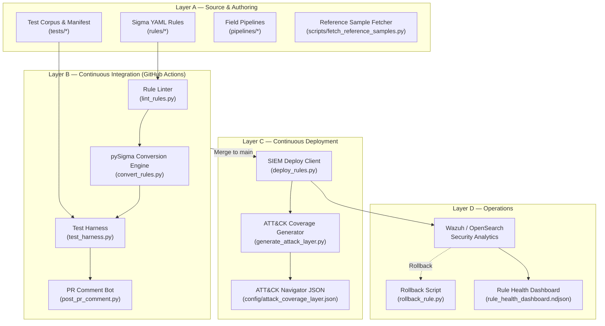

# DetectForge Architecture

DetectForge is an end-to-end **Detection-as-Code (DaC)** CI/CD pipeline built around modern software engineering principles.

## Key Components

1. **Source & Authoring**: Detection rules written in vendor-neutral Sigma format. True-positive telemetry curated from OTRF Security Datasets (Mordor) & EVTX-ATTACK-SAMPLES.
2. **Continuous Integration**: On every PR, automated scripts lint rule YAML, validate UUIDs and mandatory `attack.t####` tags, convert rules via pySigma, and execute TP/FP assertions.
3. **Continuous Deployment**: On merge to `main`, raw Sigma YAML rules are pushed via REST API directly to OpenSearch Security Analytics (Wazuh Indexer), avoiding lossy XML translation.
4. **Operations & Monitoring**: Automated release tagging, ATT&CK Navigator coverage layer generation, and programmatic rollback.
